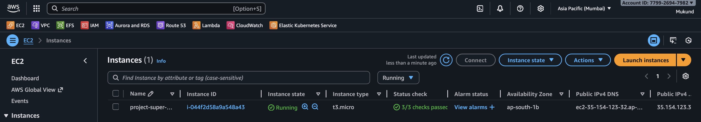
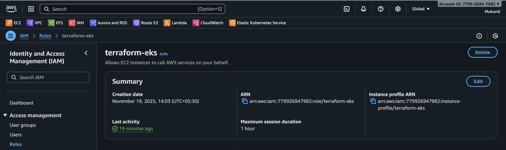
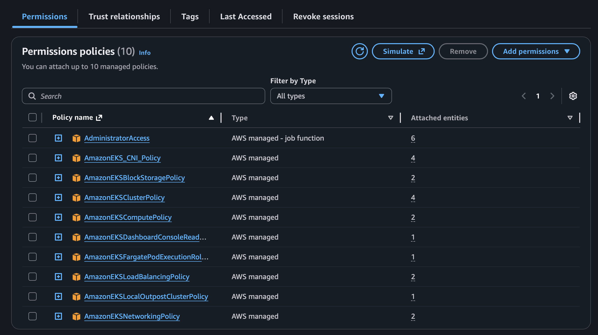
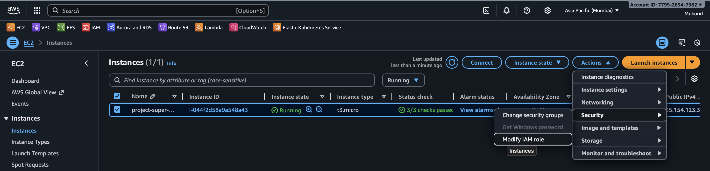
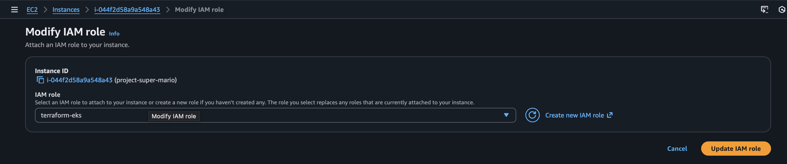

# $$\color{green}{\textbf Project: 🎮 \color{red} \textbf {Super} \ \color{orange} \ \textbf Mario  \ \textbf Bros 🍄🐢}$$

##  $\color{blue} \textbf {Project  Workflow}$
Step 1 → Login and basics setup

Step 2 → Setup Docker ,Terraform ,aws cli , and Kubectl

Step 3 → IAM Role for EC2

Step 4 →Attach IAM role with your EC2

Step 5 → Building run github action workflow on main.yaml


### $\color{red} \textbf {Step 1 → Login  and  basics  setup}$
1. Click on launch Instance
  
2. Connect to EC2-Instance

   
5. Attach role to ec2 instance

### $\color{red} \textbf {Step 2 → Setup  Tools}$

````
sudo apt update -y
````
$\color{blue} \textbf {Setup  Docker:}$
````
sudo apt install docker.io -y
sudo systemctl start docker
sudo usermod -aG docker ubuntu
newgrp docker
docker --version
````
````
sudo yum install docker -y
sudo systemctl start docker
sudo usermod -aG docker ec2-user
newgrp docker
docker --version
````

$\color{blue} \textbf {Setup Terraform:Ubuntu}$
````
wget -O- https://apt.releases.hashicorp.com/gpg | sudo gpg --dearmor -o /usr/share/keyrings/hashicorp-archive-keyring.gpg
echo "deb [signed-by=/usr/share/keyrings/hashicorp-archive-keyring.gpg] https://apt.releases.hashicorp.com $(lsb_release -cs) main" | sudo tee /etc/apt/sources.list.d/hashicorp.list
sudo apt update && sudo apt install terraform

````
- Amazon linux
````
sudo yum install -y yum-utils shadow-utils
sudo yum-config-manager --add-repo https://rpm.releases.hashicorp.com/AmazonLinux/hashicorp.repo
sudo yum install terraform -y
````
${\color{blue} \textbf {Setup  AWS CLI:}}$
````
curl "https://awscli.amazonaws.com/awscli-exe-linux-x86_64.zip" -o "awscliv2.zip"
sudo apt install unzip 
unzip awscliv2.zip
sudo ./aws/install
aws --version

````

## ${\color{blue} \textbf {Install kubectl}}$
Download the latest release with the command:
````
curl -LO "https://dl.k8s.io/release/$(curl -L -s https://dl.k8s.io/release/stable.txt)/bin/linux/amd64/kubectl"
````

Install kubectl:
````
sudo install -o root -g root -m 0755 kubectl /usr/local/bin/kubectl
````
Note:
If you do not have root access on the target system, you can still install kubectl to the ~/.local/bin directory:
````
chmod +x kubectl
mkdir -p ~/.local/bin
mv ./kubectl ~/.local/bin/kubectl
````
````
kubectl version --client
````
### $\color{red} \textbf {Step 3 → IAM  Role  for  EC2}$
create role:


### $\color{red} \textbf {Step 4 →Attach  IAM  role  with your  EC2 }$
go to EC2 
click on actions → security → modify IAM role option
- administrator access
- eks



### $\color{red} \textbf {Step 5 → Building Infrastructure github action workflow on main.yaml


## navigate to github action 
crreate workflow 


## chose workflow and create 


## Write main.yaml file 

[main.yaml](./.github/workflows/main.yml)

check for the code is running in github_action -->main.yaml 


## to destroy the workflow 
write destroy workflow file 


